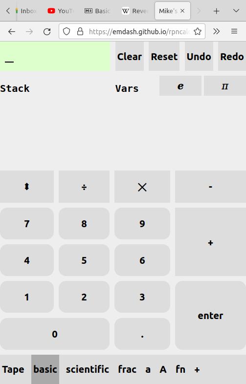
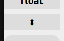
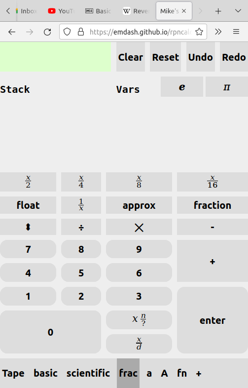
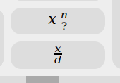

# Mobile-First RPN Calculator

- Uses reverse-polish notation ([RPN](https://en.wikipedia.org/wiki/Reverse_Polish_notation))
- visible stack
- visible variable environment
- Unlimited undo and redo
- Fraction mode
- Single-page
- Mobile-first, responsive layout.

You can try it [here](https://emdash.github.io/rpncalc)

## Overview

### Motivation

Every couple years, I like to write a single-page app from scratch,
just to see how the core technologies of the web: HTML, CSS,
JavaScript, have evolved. My rules are:

- Absolutely *zero* external dependencies.
- Absolutely *zero* external tooling.
- Must be good enough to replace the native calculator on my android
  phone.
  
### Caveats

At present, only Firefox is supported, because that is my primary
browser. In particular, Chromium-based browsers no longer support
MathML without a polyfill.

## Usage

### Basic functionality

- The contents of the display are referred to as the "input
  accumulator", or just the "accumulator" for short.
- Symbol keys are rendered with rounded corners. Operator keys have square corners.
- Most operations consume either a single operand or two
  operands. There are a couple (like `sum`) which consume the entire
  stack.
  
#### The swap key

- Sometimes you enter operands in the wrong order. You can use the
  swap key  to exchange the top two stack
  elements in this case.
  
### Variables

You can store the top of stack into a variable. With the value you want
to save want to save on top of the stack:
- Switch to `a` or `A` mode.
- Type the name of the variable you want
- Press the `=` key.
- The variable will appear under the `vars` pane.
- Press the variable to recall the value to the top of stack.
  
### Auto enter

As a convenience, a non-empty input accumulator is automatically
transferred to the top of stack. So, either of the following produces
the same result:
  
- `3 <enter> 4 <enter> + 5 <enter> *`, or equivalently,
- `3 <enter> 4 + 5 *`

### Fractional Quantities

Enter enter fraction mode (`frac`), the decimal
point key is replaced with two special keys. 

The upper key is is the "num" key. It is for entering
mixed-numbers. After pressing this key, the existing contents of the
accumulator will become the whole-number portion. Subsequent digits
will appear in the numerator.

The lower key is the "denom" key. After pressing this key, subsequent
digits will appear in the denominator.

Fractions can be transfered to the stack like any other value.

The following key sequences all produce the same result:

- `3` `num` `3` `denom` `4` `enter`
- `3` `enter` `3` `denom` `4` `+`
- `3` `enter` `3` `x/4` `+`
- `15` `denom` `4` `enter`
- `15` `4` `/`

### Unit-Based Calculations

This feature is planned, but not yet implemented.

### Tape Mode

This mode is not yet finished. Currently it only allows viewing the
input history, and contains some bugs.

### Roadmap

- persist sessions via local storage
- unit-based arithmetic (dimensional analysis)
  - us customary
  - SI
  - CGS
- drag-and-drop stack stack reordering.
- tape / history editing.
- user-defined functions.
- user-defined units and conversions.
- improve keyboard operation
